# Documentación MarkDown Web GigaGym


---
Título: "GigaGym"
<br>Autores: "Maria y Sergio"
<br>Date: "23/11/2023"
---

## Descripción

El proyecto se trata de implementar tanto el backend como el frontend de un gimnasio que ofrece diversos cursos a los usuarios que se vayan a inscribir. 

Estamos comprometidos a ofrecer una plataforma fácil de usar para usuarios y administradores por igual.


## Estilo y Colores

Nos hemos decantado por un estilo minimalista con colores oscuros combinado con una fuente suave
y de color blanco para que se diferencie y destaque con el fondo.

En la página principal destacamos el logo también con sus colores oscuros, el título y bienvenida
al gimnasio, slogan y un video de uno de nuestros nuevos miembros. También hemos añadido el menu,
donde podremos acceder a los diferentes cursos, a los horarios del gimnasio, a la información del
contacto en caso de dudas y por último el botón para iniciar sesión o registrarse.


## Estructura de la back

Hemos dividido el proyecto por carpetas para que sea mucho más facial de localizar.
La estructura es la siguiente:

  - En el apartado java encontraremos las siguientes carpetas:

    - Dao que manajean la interacción con la base de datos de nuestras diferentes clases creadas.
    - Model en las que se han integrado las clases que se utilizan para este proyecto
    - Service es el que maneja toda la lógica del programa
    - Servlet es el encargado de interactuar con el modelo y el servicio y enviar las respuestas
    - Utils hemos utilizado una clase aparte dedicada solo a los utils utilizados así es más fácil y rápido de modificar los datos sin tener que acceder a cada uno de ellos
  
- En el apartado webapp:

    - Carpeta con las imagenes utilizadas en el proyecto
    - Los diferentes jsp, css y js que hemos utilizado para implementar la página web
  


Como hemos comentado anteriormente en ***Dao*** hemos creado las diferentes clases para poder manejar la interacción con la base de datos, 
nos hemos decantado por crear una clase DAO para cada clase que hemos creado porque hemos considerado que es más ordenado y más fácil de utilizar en caso de necesitar modificación.

En este apartado nos hemos centrado más en la conexión con la base de datos, es decir, desde el DAO se controla el acceso y conexión con la base de datos como la desconexión.

En el caso del ***MODELO*** nos hemos centrado únicamente en crear las clases que se vayan a utilizar con sus diferentes atributos, sus getters, setter y el toString.

En nuestro proyecto el ***SERVICE*** es el que maneja toda la lógica del proyecto. Tenemos un único SERVICE para todo el proyecto, se ha intentado estructurar de una manera ordenada y fácil de encontrar.

Es el encargado de gestionar las diferentes peticiones tanto de post y get como comprobar si el usuario existe y grardar la sesión:

Diferentes peticiones de get y post:

- ***Usuarios:*** utilizamos un **CRUD** para usuarios, utilizando nuestra clase Usuario y nuestro usuarioDao para interactuar con la base de datos.

  - **getUsuarios** obtiene la lista de usuarios de la base de datos.
  - **postUsuario** maneja las solicitudes enviadas para la gestión de usuarios, como el añadir usuario, actualizar usuario o eliminar usuario.
   
    - La solicitud se maneja mediante action, para insertar, eliminar o actualizar.
    - Se tienen en cuenta los datos username, email, pass y tipo. Tipo para determinar si es administrador o no
    - Una vez determinado si es un insert o un update redirige a la página de registro.

- ***Cursos:*** como en el caso de usuarios utilizamos se utiliza un **CRUD** para manejar los diferentes cursos

    - **getCursos** obtiene la lista de cursos de la base de datos.
    - **postCursos** maneja las solicitudes enviadas para la gestión de cursos, como el insert.

        - La solicitud se maneja mediante action para insertar, la función de eliminar o actualizar solo lo tiene el administrador.
        - Si la acción es "insertar", crea un nuevo curso y lo inserta en la base de datos.
        - Redirige a la página de cursos después de realizar la operación.
- ***Reservas:*** como en los casos anteriores utilizamos un **CRUD** para manejar los diferentes datos.

    - **getReservas** obtiene la lista de reservas de la base de datos.
    - **postReservas** maneja las solicitudes enviadas para la gestión de reservas, como el insert, update o delete.

        - La solicitud se maneja mediante action para insert, update y delete.
        - Realiza la operación correspondiente según la acción especificada.
        - Redirige a la página de reserva de cursos después de realizar la operación.
- ***Administrador:*** como en los casos anteriores utilizamos un **CRUD** para manejar los diferentes datos. 
Gestiona operaciones administrativas en la interfaz del administrador. Utiliza modelos como ModelCursos y Usuario junto con objetos DAO (adminDao, cursosDao, usuarioDao) para interactuar con la base de datos.

    - **getAdmin** obtiene información necesaria para la interfaz del administrador y luego la envía a la página `admin.jsp`.
      
      - Conecta con las bases de datos relevantes.
      - Obtiene la lista de cursos y usuarios.
      - Establece atributos en la solicitud para los cursos y usuarios.
      - Redirige la solicitud a la página `admin.jsp`.
      - Desconecta de las bases de datos.
    - **postAdmin** maneja las solicitudes enviadas para la gestión de reservas, como el insert, update o delete.

        - Según la acción especificada:
            - **Curso:**
              - Inserta un nuevo curso. 
              - Actualiza la información de un curso existente. 
              - Elimina un curso existente.
            - **Usuario:**
              - Inserta un nuevo usuario. 
              - Actualiza la información de un usuario existente. 
              - Elimina un usuario existente. 
            - Redirige a la página del admin después de realizar la operación. 
            - Desconecta de las bases de datos correspondientes.
- ***Favoritos:*** como en los casos anteriores utilizamos un **CRUD** para manejar los diferentes datos.

    - **getFavoritos** obtiene la lista de favoritos de la base de datos.
    - **postFavorito** según la action específica:

        - Insert:
            - Crea un nuevo favorito con la información del curso y usuario. 
            - Inserta el nuevo favorito en la base de datos. 
        - Eliminar:
          - Elimina un favorito específico de la base de datos. 
        - Redirige a la página de favoritos o cursos después de realizar la operación. 
        - Desconecta de las bases de datos correspondientes.

**Ejemplo del Get y Post**


El ***SERVLET*** es el encargado de interactuar con el *MODEL* y el *SERVICE* y enviar las respuestas al postman para que se muestren por pantalla.

La clase ***UTILS*** contiene todos los métodos estáticos utilizados en la base de datos.


- ***APARTADO WEB*** :

Como hemos comentado anteriormente en este apartado se han incluido los diferentes jsp, css y js que dan forma a nuestra página web


- Hemos creado un index, para que se encargue de llamar a las diferentes páginas que manejamos.
- Para el **LOGIN** y **REGISTRO** hemos incluido un pop-up para que en el momento que indiques que quieres iniciar sesión o registrar aparece en la pantalla, es una ventana superpuesta en la que hemos difuminado el fondo.

- ***INSERTAR UNA FOTO DE LA PAGINA DE INICIO***
- 
- Estamos utilizando un js para que maneje la interfaz, es decir, para que lo muestre o oculte el *LOGIN* o el *REGISTRO*, hasta que el usuario no indique lo contrario.

``` javaScript const wrapper = document.querySelector('.wrapper');
const wrapper = document.querySelector('.wrapper');
const loginLink = document.querySelector('.login-link');
const registerLink = document.querySelector('.register-link');
const btnPopup = document.querySelector('.btnLogin-popup');
const iconClose = document.querySelector('.icon-close');

registerLink.addEventListener('click', ()=>{
    wrapper.classList.add('active');
});

loginLink.addEventListener('click', ()=>{
    wrapper.classList.remove('active');
});

btnPopup.addEventListener('click', ()=>{
    console.log("abrir popup");
    wrapper.classList.add('active-popup');
});

iconClose.addEventListener('click', ()=>{
    console.log("cerrar popup");
    wrapper.classList.remove('active-popup');
});
```
- Hemos intentado mantener el mismo css para las diferentes páginas así se ve más profesional y limpio.


- Nuestros jsp's hemos combinado HTML y Java para poder presentar nuestra pagina web y sus distintos apartados,
junto a la recogida de datos por parte de Java de nuestra base de datos, donde proporcionamos informacion, por ejemplo, de los usuarios registrados
y cursos del gimnasio.


**Pagina principal**


**Pagina de Cursos**


# Documentación MarkDown Aplicacion GigaGym

Antes de empezar a crear la aplicación hemos diseñado las diferentes pantallas que tendría como se puede apreciar en la imagen de abajo.


También hemos creado un Logo diferente para la aplicación para que vaya más acorde con los colores que hemos elegido.


Cuando empezamos a diseñar la aplicación, una vez empezado nos hemos decantado por cosas diferentes a la hora del diseño, porque los dos teníamos claro que nos gustaría que la el diseño del fondo sea con degradados.

Hemos estructurado el proyecto de la siguiente manera:

- En el java hemos incluido todas las clases necesarías para el funcionamiento de la aplicación
- En el apartado res/drawable hemos creado los fondos difuminados que utilizaremos en la aplicación,
- En el apartado res/layout hemos diseñado como queremos que sea nuestras pantallas
- Hemos creado un menu
- En el apartado de values hemos implementado los colores que utilizaremos en la aplicación
- En los strings hemos creado todos los textos a utilizar para que sea más fácil y en caso de modificación se modifique solo desde un sitio y no tener que ir pantalla por pantalla.

Como hemos comentado nuestra aplicación tiene un diseño diferente a lo que habíamos pensado originalmente:

Empieza con una página de bienvenida en la que únicamente hemos implementado unas animaciones y al dar al botón Get in te lleva directamente a la pantalla de Login

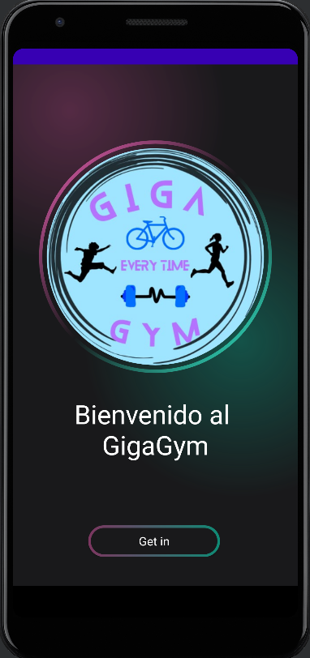

Como hemos comentado anteriormente nos hemos decantado por un fondo difuminado que se ha creado mediante el Drowable Resurce File:

``` <?xml version="1.0" encoding="utf-8"?>
<layer-list xmlns:android="http://schemas.android.com/apk/res/android">
    <item>
        <shape>
            <gradient android:startColor="#997c3660"
                android:centerColor="#19191b"
                android:endColor="#19191b"
                android:type="radial"
                android:gradientRadius="110%p"
                android:centerX="0.2"
                android:centerY="0.1"/>
        </shape>
    </item>
    <item>
        <shape>
            <gradient android:startColor="#800f8a75"
                android:centerColor="@android:color/transparent"
                android:endColor="@android:color/transparent"
                android:type="radial"
                android:gradientRadius="110%p"
                android:centerX="0.8"
                android:centerY="0.6"/>
        </shape>
    </item>

</layer-list>

```
También hemos aprovechado estos colores para crear los bordes de los botones:

``` <?xml version="1.0" encoding="utf-8"?>
<layer-list xmlns:android="http://schemas.android.com/apk/res/android">
    <item>
        <shape android:shape="rectangle">
            <corners android:radius="50dp"/>
            <gradient android:startColor="#7c3660"
                android:endColor="#0f8a75"
                android:type="linear"
                android:angle="360"/>
            <size android:width="24dp"
                android:height="24dp"/>

        </shape>
    </item>
    <item android:top="4dp" android:bottom="4dp" android:left="4dp" android:right="4dp">
        <shape android:shape="rectangle">
            <corners android:radius="50dp"/>
            <solid android:color="#19191b"/>

        </shape>
    </item>

</layer-list>
```
Al que también le hemos creado un background:
``` <?xml version="1.0" encoding="utf-8"?>
<layer-list xmlns:android="http://schemas.android.com/apk/res/android">
    <item>
        <shape>
            <gradient android:startColor="#507c3660"
                android:endColor="#19191b"
                android:centerColor="#19191b"
                android:centerX="0.3"
                android:centerY="0.5"
                android:gradientRadius="100%p"
                android:type="radial"/>
        </shape>
    </item>
    <item>
        <shape>
            <gradient android:centerColor="@android:color/transparent"
                android:centerX="0.5"
                android:centerY="0.5"
                android:endColor="@android:color/transparent"
                android:gradientRadius="100%p"
                android:startColor="#300f8a75"
                android:type="radial"
                />
        </shape>
    </item>
    <item>
        <shape>
            <gradient android:centerColor="@android:color/transparent"
                android:centerX="0.7"
                android:centerY="0.5"
                android:endColor="@android:color/transparent"
                android:gradientRadius="100%p"
                android:startColor="#400f8a75"
                android:type="radial"
                />
        </shape>
    </item>

</layer-list>
```
Una vez iniciada la aplicación está la pantalla de ***LOGIN***

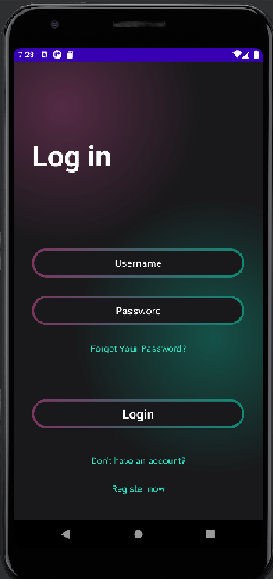

Hemos utilizado el SharedPreferences en el LoginActivity de java para que:

- Guarde la sesión del usuario
- Compruebe si el usuario existe
- Y para limpiar los datos una vez el usuario cierra sesión

```
private void saveSession(String name, String pass) {
// Guardar datos de sesión
SharedPreferences.Editor editor = sharedPreferences.edit();
editor.putString(KEY_NAME, name);
editor.putString(KEY_PASS, pass);
editor.apply();
}

    private boolean checkSession() {
        SharedPreferences prefs = getSharedPreferences(
                SHARE_PREF_NAME, Context.MODE_PRIVATE);
        String username = prefs.getString(KEY_NAME, null);
        String password = prefs.getString(KEY_PASS, null);
        if (username != null) {
            return true;
        }
        return false;
    }

    // Limpiar el Fichero
    private void clearSession() {
        // Borrar datos de sesión
        SharedPreferences.Editor editor = getSharedPreferences(
                SHARE_PREF_NAME, Context.MODE_PRIVATE).edit();
        editor.clear();
        editor.apply();
    }
```
Si tienes cuenta te lleva directamente a la pantalla de cursos (MainActivity), en caso de no tener cuenta puedes registarte, 
la pantalla de registo (RegisterActivity) es la misma que la de login solo que con unos campos más o en caso de que el usuario no recuerde su contraseña hemos creado la opción de recuperar la contraseña mediante su correo.

En este apartado hemos utilizado SharedPreferences para guardar los datos del usuario

Una vez has conseguido iniciar sesión te lleva a la pantalla de los cursos que la hemos diseñado de la siguiente manera:

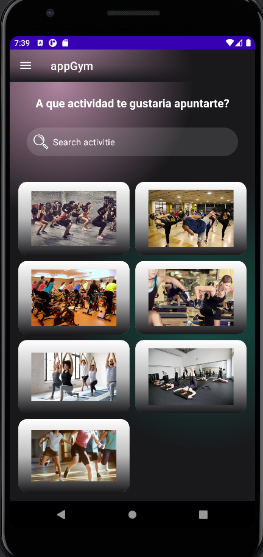

- Hemos incluido un apartado para buscar el curso que se imparten en el gimnasio, al clicar en la imagen te lleva al apartado de detalles donde podrás reservar el curso.

- El menu arriba que al desplegarlo quedaría de la siguiente manera:
- 
  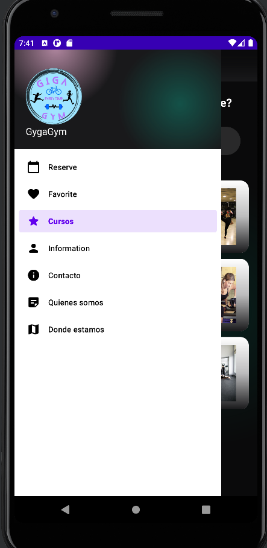

Al clicar cualquier imagen te lleva a los detalles de ese curso en el que tendrás la oportunida, si te interesa, a reservar la actividad o, por el contrario, guardarla en favoritos para más adelante.

  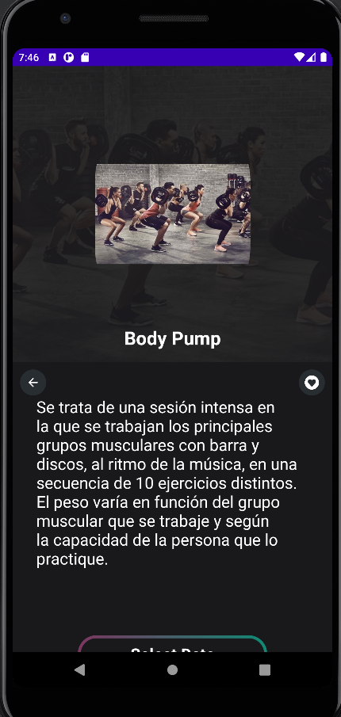  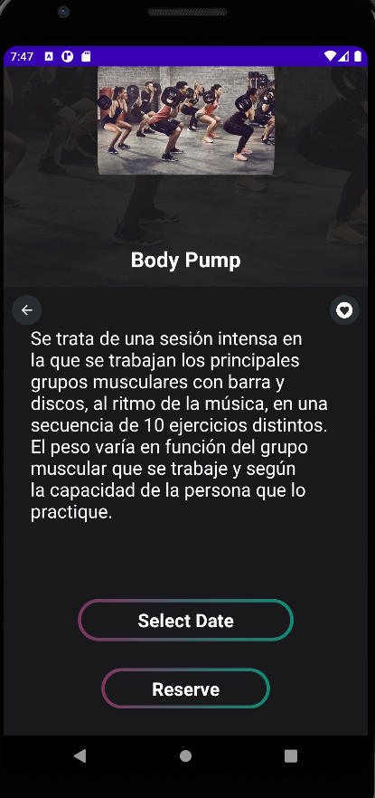

También hemos agregado el acceso mediante menu al:

- Reservas
- Favoritos
- Cursos
- Contacto
- Quienes somos 
- Donde estamos

 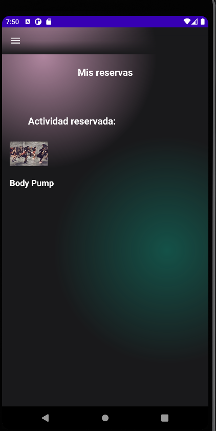  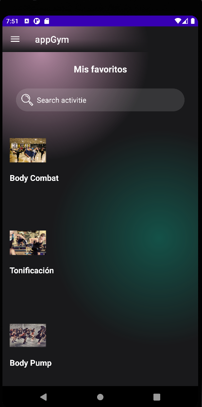 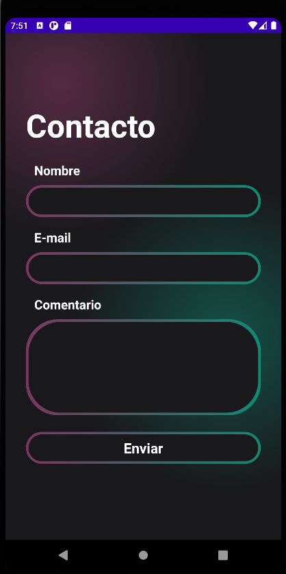  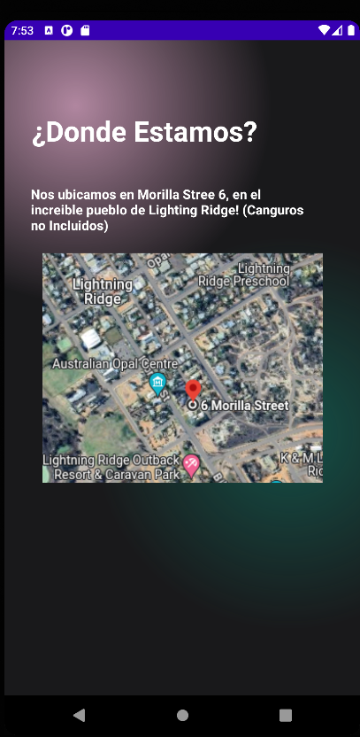 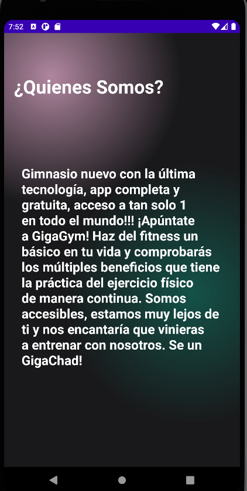 


 # Estructura de la Aplicación Android

Hemos estructurado la aplicacion tal i como indica android, las clases con sus respectivos layouts


- **`Activities.java`**: Clase que define el modelo de las actividades en la aplicación.
  - **`ActivitiesAdapter.java`**: Adaptador para la lista de actividades.


- **`ContactActivity.java`**: Actividad que permite al usuario contactar con el gimnasio.


- **`DetailActivity.java`**: Actividad que muestra detalles de un curso en específico y da la opcion de "Me gusta"
y concretar una reserva.
    - **`activity_detail.xml`**: Diseño de la interfaz de la actividad de detalles.


- **`FavoriteActivity.java`**: Clase que gestiona las actividades favoritas.
  - **`Favorite.java`**: Clase donde se declaran las variables, constructor y metodos Set y Get de Favoritos.
  - **`FavoriteAdapter.java`**: Adaptador para la lista de actividades favoritas.


- **`HomeActivity.java`**: Actividad que brinda la informacion del usuario y incluye el logout.
    - **`activity_home.xml`**: Diseño de la interfaz de la actividad.


- **`IntroActivity.java`**: Actividad de introducción o bienvenida.
    - **`activity_intro.xml`**: Diseño de la interfaz de la actividad de la primera pantalla donde se incluye la animacion del logo y titulo.


- **`LoginActivity.java`**: Actividad de inicio de sesión.
    - **`activity_login.xml`**: Diseño de la interfaz de la actividad de inicio de sesión.


- **`MainActivity.java`**: Actividad principal que se inicia al abrir la aplicación donde se muestran los cursos.
    - **`activity_main.xml`**: Diseño de la interfaz de la actividad principal.


- **`OnSomActivity.java`**: Actividad que proporciona información sobre donde se encuentra el gimnasio.
    - **`activity_onsom.xml`**: Diseño de la interfaz de la actividad de información.


- **`QuiSomActivity.java`**: Actividad que proporciona información sobre el gimnasio haciendo una breve descripción.
    - **`activity_quisom.xml`**: Diseño de la interfaz de la actividad de información.


- **`RecoverPassActivity.java`**: Actividad para recuperar la contraseña.
    - **`activity_recover_pass.xml`**: Diseño de la interfaz de la actividad de recuperación de contraseña.


- **`RegisterActivity.java`**: Actividad de registro de usuario.
    - **`activity_register.xml`**: Diseño de la interfaz de la actividad de registro.


- **`Reserve.java`**: Clase que modela una reserva.
  - **`ReserveActivity.java`**: Actividad que muestra las reservas realizadas.
      - **`activity_reserve.xml`**: Diseño de la interfaz de la actividad de reservas.
      - **`reserve_item.xml`**: Diseño del elemento de lista para una reserva.
  - **`ReserveAdapter.java`**: Adaptador para la lista de reservas.


**Ejemplo de MainActivity**


El **Menu** se encarga de agrupar los diferentes apartados de la aplicacion en items para que despues desde MainActivity podamos
configurar con un metodo, hacia donde nos redirige:


